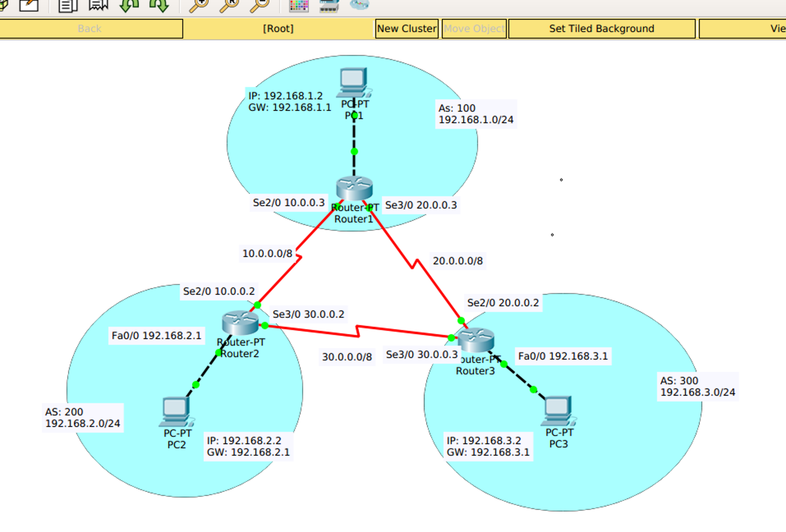

## BGP example

网络拓扑图为 `bgp-for-ppt.pkt` 文件



以下为相关路由器的配置（在导入到Package Tracer后会自动执行，以下命令不同再次输出）

请事先进入 `Router(config)` 模式

## Router1

```txt
router bgp 100
network 10.0.0.0
network 20.0.0.0
network 192.168.1.0
neighbor 10.0.0.2 remote-as 200
neighbor 20.0.0.2 remote-as 300
```

---

## Router2

```txt
router bgp 200
network 10.0.0.0
network 30.0.0.0
network 192.168.2.0
neighbor 10.0.0.3 remote-as 100
neighbor 30.0.0.3 remote-as 300
```

---

## Router3

```txt
router bgp 300
network 20.0.0.0
network 30.0.0.0
network 192.168.3.0
neighbor 20.0.0.3 remote-as 200
neighbor 30.0.0.2 remote-as 300
```

